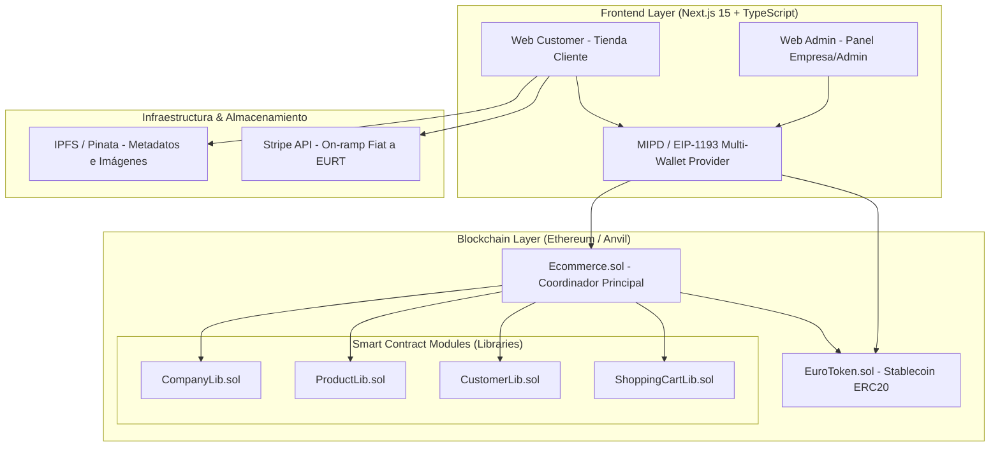

# INFORME DETALLADO DEL PROYECTO: E-COMMERCE BLOCKCHAIN & STABLECOIN

**Proyecto:** Decentrazalized E-Commerce Ecosystem (anlucorporations/ecommerce)  
**Fecha de Análisis:** 10 de Agosto de 2026  
**Tecnologías Principales:** Solidity (^0.8.13), Foundry, Next.js 15 (App Router), TypeScript, Ethers.js v6, MIPD (EIP-1193), TailwindCSS, Anvil.

---

## 1. RESUMEN EJECUTIVO

El proyecto **E-Commerce Blockchain** es un ecosistema descentralizado completo que combina la tecnología de contratos inteligentes en Ethereum con aplicaciones web modernas. Su propósito es permitir el comercio electrónico transparente, sin intermediarios financieros tradicionales en el procesamiento directo, utilizando una **Stablecoin nativa (EuroToken / EURT)** vinculada al Euro (1 EURT = 1 EUR, 6 decimales) y ofreciendo pasarelas de pago mixtas (fiat vía Stripe y cripto vía tokens ERC20).

El repositorio está estructurado en una arquitectura monorepo modular que abarca:
1. **Contratos Inteligentes (Smart Contracts)** desarrollados en Solidity y testeados/desplegados con **Foundry**.
2. **Panel de Administración Web (`web-admin`)** para la gestión de empresas vendedoras.
3. **Tienda Web para Clientes (`web-customer`)** para exploración de productos, carrito de compras y checkout.
4. **Scripts de Automatización en Bash** para compilación, testing, despliegue automatizado y vinculación de variables de entorno.

---

## 2. ARQUITECTURA GENERAL DEL SISTEMA



---

## 3. DESGLOSE DE LA ESTRUCTURA DE ARCHIVOS Y COMPONENTES

El proyecto se organiza en las siguientes carpetas y archivos clave:

```
ecommerce/
├── sc-ecommerce/                 # Smart Contracts principales del E-Commerce (Foundry)
│   ├── src/
│   │   ├── Ecommerce.sol         # Contrato principal/coordinador
│   │   └── libraries/            # Librerías modulares de lógica de negocio
│   │       ├── CompanyLib.sol    # Registro y estado de empresas
│   │       ├── ProductLib.sol    # Catálogo de productos e inventario
│   │       ├── CustomerLib.sol   # Registro y métricas de clientes
│   │       └── ShoppingCartLib.sol # Gestión de carritos por cliente
│   ├── test/                     # Suites de pruebas unitarias e integración (Forge)
│   └── script/                   # Scripts de despliegue Solidity (DeployEcommerce.s.sol)
│
├── stablecoin/                   # Módulo de la Stablecoin EuroToken
│   └── sc/
│       ├── src/EuroToken.sol     # Token ERC20 con 6 decimales y función mint restringida
│       ├── test/                 # Tests unitarios del EuroToken
│       └── script/               # Script de despliegue DeployEuroToken.s.sol
│
├── web-admin/                    # Aplicación Web Next.js 15 (Panel de Administración)
│   ├── src/
│   │   ├── app/                  # App Router (page.tsx, layout.tsx, companies/page.tsx)
│   │   ├── components/           # Componente WalletConnect (MIPD EIP-1193)
│   │   ├── hooks/                # Hooks personalizados (useWallet, useContract)
│   │   └── lib/                  # Proveedor de wallet, ABIs y direcciones
│   ├── package.json
│   └── tsconfig.json
│
├── web-customer/                 # Aplicación Web Next.js 15 (Tienda para Clientes)
│   ├── src/
│   │   ├── app/                  # App Router (landing, cart, orders, products)
│   │   ├── components/           # Componente WalletConnect (MIPD EIP-1193)
│   │   ├── hooks/                # Hooks personalizados (useWallet, useContract, useCart)
│   │   └── lib/                  # Configuración Web3 y ABIs
│   ├── package.json
│   └── tsconfig.json
│
├── deploy-all.sh                 # Script maestro de despliegue automatizado
├── restart-all.sh                # Script para reinicio completo del entorno local
├── simple-deploy.sh              # Despliegue simplificado
├── test-deployment.sh            # Script de verificación y test de salud del despliegue
└── ARCHITECTURE.md, README.md, PROJECT_SUMMARY.md... # Documentación técnica exhaustiva
```

---

## 4. ANÁLISIS TÉCNICO DETALLADO DE COMPONENTES

### 4.1 Contratos Inteligentes (Smart Contracts)

1. **`EuroToken.sol` (`stablecoin/sc/src/EuroToken.sol`)**:
   - Basado en el estándar ERC20 de OpenZeppelin.
   - **Decimales:** Redefinido a `6` decimales para coincidir con la precisión habitual de las stablecoins (como USDC/EURC) y facilitar la conversión con centavos de euro.
   - **Control de Acceso:** Cuenta con restricción `onlyOwner` para la función `mint`, permitiendo la emisión controlada tras verificar pagos en fiat (Stripe).

2. **`Ecommerce.sol` y Librerías (`sc-ecommerce/src/`)**:
   - Adopta un patrón de diseño basado en **Librerías Solidity** para evitar sobrepasar el límite de tamaño de contrato (`EIP-170`) y optimizar los costos de gas:
     - `CompanyLib`: Maneja el registro de empresas vendedoras, activación y desactivación.
     - `ProductLib`: Administra la adición de productos, actualización de inventario, precios y enlaces IPFS para imágenes.
     - `CustomerLib`: Rastrea las compras totales y montos gastados por cada dirección de cliente.
     - `ShoppingCartLib`: Almacena el estado de los carritos de compras asociados a cada dirección de wallet.
   - **Facturación y Pagos:** El contrato `Ecommerce.sol` expone funciones para crear facturas (`Invoice`), procesar pagos mediante `transferFrom` del `EuroToken` y emitir eventos para auditoría e indexación.

---

### 4.2 Aplicaciones Web Frontend (Next.js 15)

1. **Detección Multi-Wallet Avanzada (`MIPD / EIP-1193`)**:
   - Implementa la especificación EIP-6963 (Multi-Injected Provider Discovery) mediante la librería `mipd`.
   - Permite la detección limpia y sin conflictos de múltiples billeteras instaladas en el navegador del usuario (MetaMask, Coinbase Wallet, Rabby, Trust Wallet, etc.).
   - Incluye auto-reconexión de la última billetera utilizada y listeners de cambio de cuenta o red.

2. **`web-admin` (Panel de Administración)**:
   - Permite a los administradores del sistema registrar nuevas empresas vendedoras (`registerCompany`).
   - Muestra el listado de empresas registradas con su estado (activa/inactiva) mediante consultas directas a los smart contracts usando `ethers.js v6`.

3. **`web-customer` (Tienda de Clientes)**:
   - Proporciona una interfaz para clientes con soporte de carrito de compras local/on-chain mediante el hook `useCart`.
   - Navegación estructurada para productos, carrito, órdenes pasadas y gestión de saldo de tokens.

---

### 4.3 Automatización del Despliegue (`deploy-all.sh`)

El proyecto destaca por su elevado nivel de automatización para desarrollo local:
- Inicia compilaciones con `forge build`.
- Ejecuta los scripts de despliegue en la red local de **Anvil** (`http://localhost:8545`).
- Captura dinámicamente las direcciones resultantes del despliegue (`EuroToken` y `Ecommerce`).
- Genera y actualiza automáticamente los archivos `.env.local` en `web-admin` y `web-customer`.
- Crea el archivo actualizado `DEPLOYED_ADDRESSES.md` con los timestamps y hashes de transacción.

---

## 5. ESTADO DE IMPLEMENTACIÓN Y NIVELES DE COMPLETITUD

| Módulo / Funcionalidad | Estado | Detalles / Observaciones |
| :--- | :---: | :--- |
| **Smart Contracts (EuroToken)** | ✅ **100% Completado** | ERC20 con 6 decimales, minting y tests unitarios. |
| **Smart Contracts (Ecommerce + Libs)** | ✅ **100% Completado** | Empresas, productos, carritos, facturas y pagos. |
| **Pruebas de Contratos (Foundry)** | ✅ **100% Completado** | Tests pasando para todas las librerías y contratos. |
| **Despliegue Automatizado (Bash)** | ✅ **100% Completado** | `deploy-all.sh` funcional con extracción de `.env.local`. |
| **Manejo de Wallets (EIP-1193)** | ✅ **100% Completado** | Soporte multi-wallet probado y funcional. |
| **Panel Admin (Empresas)** | ✅ **90% Completado** | Registro y listado funcional. |
| **Tienda Cliente (UI/UX)** | 🟡 **70% Completado** | Carrito y navegación listos; catálogo visual pendiente de integración con IPFS real. |
| **Integración Fiat (Stripe Webhook)** | 🟡 **Preparado** | Estructurado conceptualmente en arquitectura; falta servidor de backend para escuchas de webhook. |

---

## 6. GUÍA DE EJECUCIÓN Y VERIFICACIÓN LOCAL

Para poner en marcha el proyecto localmente de forma rápida:

```bash
# 1. En una terminal, iniciar el nodo local Anvil
anvil

# 2. En una segunda terminal, ejecutar el despliegue automático
./deploy-all.sh

# 3. Iniciar la aplicación Web Admin (Puerto 3000)
cd web-admin && npm run dev

# 4. Iniciar la aplicación Web Customer (Puerto 3001)
cd web-customer && npm run dev -- -p 3001
```

---

## 7. CONCLUSIONES Y RECOMENDACIONES

1. **Solidez de Arquitectura:** La separación del backend blockchain en librerías y contratos especializados proporciona alta mantenibilidad y bajo consumo de gas.
2. **Seguridad y Extensibilidad:** El sistema de tokens y compras responde a patrones estándares de la industria Web3 (OpenZeppelin + EIP-1193).
3. **Puntos Próximos de Desarrollo:**
   - Implementar la carga directa de imágenes a IPFS (vía Pinata API) en la creación de productos.
   - Completar el servidor de backend (Express/NestJS) para procesar los webhooks de Stripe y autorizar el `mint` de `EuroToken`.
   - Conectar la vista del catálogo de productos en `web-customer` con los eventos y consultas del contrato `Ecommerce.sol`.
